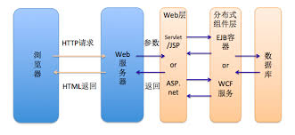

# web开发简介

用户请求后端，后端处理业务逻辑，数据库存储数据，前端渲染页面。点餐，看菜品，看员工，看订单


前端（Front-End）：这是用户直接交互的部分，包括网页的设计、布局和功能实现。前端技术主要涉及HTML、CSS和JavaScript，框架如React、Vue.js或Angular等。

后端（Back-End）：负责处理业务逻辑、数据处理和与数据库的交互。后端技术包括服务器端编程语言如Node.js、Python、Java、Ruby等，以及相关的框架如Express、Django、Spring等。

数据库（Database）：用于存储和管理应用程序的数据。常见的数据库有关系型数据库如MySQL、PostgreSQL，以及非关系型数据库如MongoDB、Redis等。

# Node.js CRUD 示例项目

```bash
nodejs-crud-example/
│
├── node_modules/
├── public/
│   └── style.css
├── views/
│   └── index.hbs
├── src/
│   └── modul/
│           └── user.js
│   └── routers/
│           └── main.js
│   └── app.js
├── package.json
```

## 1. 安装必要的依赖

首先，在项目目录中运行以下命令安装依赖：

```bash
npm init -y
npm config set registry https://registry.npmmirror.com
npm install express mysql2 body-parser express-handlebars

```

express 用于创建Node.js服务器。

mysql2 用于与MySQL数据库交互。

body-parser 用于解析请求体中的数据。

express-handlebars 用于渲染HBS模板。

## 2. 数据库设置

mysql安装：<https://dev.mysql.com/downloads/mysql/>
假设你已经安装并配置了MySQL，接下来我们需要创建数据库和表。

在MySQL命令行中创建一个名为 nodejs_crud_example 的数据库：

```sql
CREATE DATABASE nodejs_crud_example;
USE nodejs_crud_example;

CREATE TABLE users (
  id INT AUTO_INCREMENT PRIMARY KEY,
  name VARCHAR(100) NOT NULL,
  email VARCHAR(100) NOT NULL
);

SELECT * FROM users WHERE id = 1;
SELECT * FROM users WHERE name LIKE ? AND email LIKE ?'
```

## 3. 项目结构和文件说明

src/app.js - 设置Express应用
这是你项目的入口文件，初始化和配置Express。

```javascript
const express = require('express');
const bodyParser = require('body-parser');
const exphbs = require('express-handlebars');
const path = require('path');
const mysql = require('mysql2');
const userRouter = require('./routers/main');

const app = express();
const port = 3000;

// 配置模板引擎
app.engine('hbs', exphbs({ extname: 'hbs' }));
app.set('view engine', 'hbs');
app.set('views', path.join(__dirname, '../views'));

// 使用body-parser来处理POST请求数据
app.use(bodyParser.urlencoded({ extended: true }));

// 静态文件
app.use(express.static(path.join(__dirname, '../public')));

// 路由
app.use('/', userRouter);

// 启动服务器
app.listen(port, () => {
  console.log(`Server running at http://localhost:${port}`);
});
```

src/modul/user.js - 与数据库交互
在这个文件中，我们将定义增、删、改、查的数据库操作。

```javascript
const mysql = require('mysql2');

// 创建数据库连接
const db = mysql.createConnection({
  host: 'localhost',
  user: 'root',
  password: '', // 请根据你的MySQL设置修改密码
  database: 'nodejs_crud_example'
});

// 打开数据库连接
db.connect((err) => {
  if (err) {
    console.error('Database connection failed: ' + err.stack);
    return;
  }
  console.log('Connected to the database.');
});

// 获取所有用户
const getAllUsers = (callback) => {
  db.query('SELECT * FROM users', (err, results) => {
    if (err) throw err;
    callback(results);
  });
};

// 添加用户
const addUser = (name, email, callback) => {
  db.query('INSERT INTO users (name, email) VALUES (?, ?)', [name, email], (err, results) => {
    if (err) throw err;
    callback(results);
  });
};

// 删除用户
const deleteUser = (id, callback) => {
  db.query('DELETE FROM users WHERE id = ?', [id], (err, results) => {
    if (err) throw err;
    callback(results);
  });
};

// 更新用户
const updateUser = (id, name, email, callback) => {
  db.query('UPDATE users SET name = ?, email = ? WHERE id = ?', [name, email, id], (err, results) => {
    if (err) throw err;
    callback(results);
  });
};

module.exports = { getAllUsers, addUser, deleteUser, updateUser };
```

src/routers/main.js - 路由设置
这个文件负责定义你的路由和处理请求。

```javascript
const express = require('express');
const router = express.Router();
const userModule = require('../modul/user');

// 首页，展示所有用户
router.get('/', (req, res) => {
  userModule.getAllUsers((users) => {
    res.render('index', { users });
  });
});

// 添加用户
router.post('/add', (req, res) => {
  const { name, email } = req.body;
  userModule.addUser(name, email, () => {
    res.redirect('/');
  });
});

// 删除用户
router.get('/delete/:id', (req, res) => {
  const { id } = req.params;
  userModule.deleteUser(id, () => {
    res.redirect('/');
  });
});

// 更新用户
router.get('/edit/:id', (req, res) => {
  const { id } = req.params;
  userModule.getAllUsers((users) => {
    const user = users.find(u => u.id == id);
    res.render('edit', { user });
  });
});

// 处理更新请求
router.post('/edit/:id', (req, res) => {
  const { id } = req.params;
  const { name, email } = req.body;
  userModule.updateUser(id, name, email, () => {
    res.redirect('/');
  });
});

module.exports = router;
```

views/index.hbs - 显示用户列表
这是首页，展示所有用户，并且提供添加、编辑和删除用户的功能。

```html
<!DOCTYPE html>
<html lang="en">
<head>
  <meta charset="UTF-8">
  <meta name="viewport" content="width=device-width, initial-scale=1.0">
  <title>Node.js CRUD Example</title>
  <link rel="stylesheet" href="/style.css">
</head>
<body>
  <h1>User List</h1>
  <form action="/add" method="POST">
    <input type="text" name="name" placeholder="Name" required>
    <input type="email" name="email" placeholder="Email" required>
    <button type="submit">Add User</button>
  </form>
  <ul>
    {{#each users}}
      <li>
        {{this.name}} - {{this.email}} 
        <a href="/edit/{{this.id}}">Edit</a>
        <a href="/delete/{{this.id}}">Delete</a>
      </li>
    {{/each}}
  </ul>
</body>
</html>
```

views/edit.hbs - 编辑用户信息
这是用户编辑页面，展示当前用户信息并允许进行修改。

```html
<!DOCTYPE html>
<html lang="en">
<head>
  <meta charset="UTF-8">
  <meta name="viewport" content="width=device-width, initial-scale=1.0">
  <title>Edit User</title>
</head>
<body>
  <h1>Edit User</h1>
  <form action="/edit/{{user.id}}" method="POST">
    <input type="text" name="name" value="{{user.name}}" required>
    <input type="email" name="email" value="{{user.email}}" required>
    <button type="submit">Update</button>
  </form>
</body>
</html>
```

## 4. 启动项目

完成上述步骤后，你可以通过以下命令启动项目：

```bash
node src/app.js
```

打开浏览器并访问 <http://localhost:3000>，你将看到一个用户管理界面，可以添加、删除、编辑用户。

## 5. 项目分析和改进

### getAllUsers 的改进

如果你只想获取单个用户而不是所有用户，可以直接在数据库中查询该用户。这是一个更高效的做法，避免了将所有用户都加载到内存中。你可以修改 userModule 中的 getAllUsers 方法，添加一个根据 id 获取单个用户的方法：

```js
// 获取单个用户
const getUserById = (id, callback) => {
  db.query('SELECT * FROM users WHERE id = ?', [id], (err, results) => {
    if (err) throw err;
    callback(results[0]);  // 返回匹配的第一个用户
  });
};

module.exports = { getAllUsers, addUser, deleteUser, updateUser, getUserById };
```

然后在路由中调用 getUserById 方法来获取单个用户：

```js
router.get('/edit/:id', (req, res) => {
  const { id } = req.params;
  userModule.getUserById(id, (user) => {
    if (user) {
      res.render('edit', { user });
    } else {
      res.status(404).send('User not found');
    }
  });
});
```

这样可以避免加载所有用户，提高效率

### 完整的开发一个模糊查询接口

在这个示例中，我们将展示如何开发一个模糊查询接口，允许用户根据邮箱或姓名进行模糊查询。

1. 修改后端（路由和数据库查询）

首先，我们需要在后端添加一个新的接口，用于根据邮箱或姓名进行模糊查询。

更新 user.js 中的数据库查询方法
在 user.js 中，我们可以创建一个新的查询方法 searchUsers，用来处理模糊查询。

```js
// 根据邮箱和姓名模糊查询用户
const searchUsers = (name, email, callback) => {
  const query = 'SELECT * FROM users WHERE name LIKE ? AND email LIKE ?';
  db.query(query, [`%${name}%`, `%${email}%`], (err, results) => {
    if (err) throw err;
    callback(results);
  });
};

module.exports = { getAllUsers, addUser, deleteUser, updateUser, getUserById, searchUsers };
```

name 和 email 是通过请求的查询参数传递过来的。
LIKE ? 语法用于模糊匹配，% 表示任意字符的匹配。

2. 更新 main.js 中的路由
在路由中，我们将添加一个处理查询的 GET 请求，根据提供的查询参数（姓名和邮箱）过滤用户数据。

```js
// 搜索用户
router.get('/search', (req, res) => {
  const { name, email } = req.query; // 获取查询参数
  userModule.searchUsers(name || '', email || '', (users) => {
    res.render('index', { users });
  });
});
```

req.query 用于获取 URL 查询参数。例如，/search?name=John&email=gmail.com 会传递 name 和 email 参数。
如果没有传递查询参数，则使用空字符串进行模糊查询，返回所有用户。

3. 修改前端（index.hbs）
在前端页面中，我们将添加一个表单用于输入查询条件，并通过这些条件提交查询请求。

更新 index.hbs 页面
在 index.hbs 中，增加一个搜索表单，并显示过滤后的用户列表。

```html
<!DOCTYPE html>
<html lang="en">
<head>
  <meta charset="UTF-8">
  <meta name="viewport" content="width=device-width, initial-scale=1.0">
  <title>Node.js CRUD Example</title>
  <link rel="stylesheet" href="/style.css">
</head>
<body>
  <h1>User List</h1>

  <!-- 搜索表单 -->
  <form action="/search" method="GET">
    <input type="text" name="name" placeholder="Search by Name" value="{{name || ''}}">
    <input type="email" name="email" placeholder="Search by Email" value="{{email || ''}}">
    <button type="submit">Search</button>
  </form>

  <form action="/add" method="POST">
    <input type="text" name="name" placeholder="Name" required>
    <input type="email" name="email" placeholder="Email" required>
    <button type="submit">Add User</button>
  </form>

  <ul>
    {{#each users}}
      <li>
        {{this.name}} - {{this.email}} 
        <a href="/edit/{{this.id}}">Edit</a>
        <a href="/delete/{{this.id}}">Delete</a>
      </li>
    {{/each}}
  </ul>
</body>
</html>
```

我们在表单中添加了两个输入框，一个用于搜索用户的姓名，另一个用于搜索用户的邮箱。
{{name || ''}} 和 {{email || ''}} 用于保留搜索框中的查询值，以便在用户提交查询后，表单中仍显示原来的查询条件。
